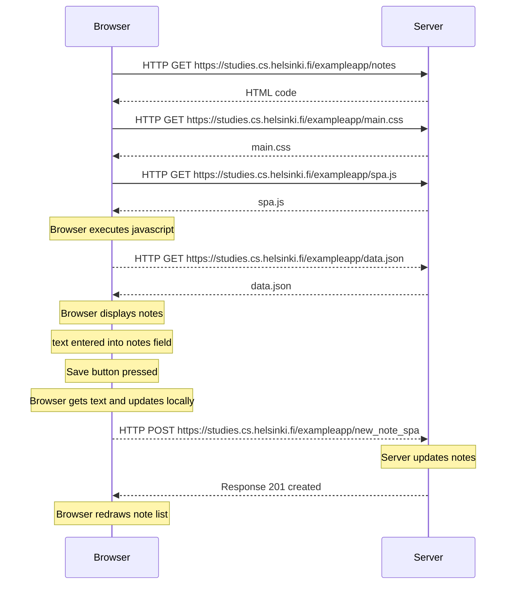

```mermaid
sequenceDiagram
Browser->>Server: HTTP GET https://studies.cs.helsinki.fi/exampleapp/notes
Server-->>Browser: HTML code
Browser->>Server: HTTP GET https://studies.cs.helsinki.fi/exampleapp/main.css
Server-->>Browser: main.css
Browser->>Server: HTTP GET https://studies.cs.helsinki.fi/exampleapp/spa.js
Server-->>Browser: spa.js
Note over Browser: Browser executes javascript
Browser-->>Server: HTTP GET https://studies.cs.helsinki.fi/exampleapp/data.json
Server-->>Browser: data.json
Note over Browser: Browser displays notes
Note over Browser: text entered into notes field
Note over Browser: Save button pressed
Note over Browser: Browser gets text and updates locally
Browser-->>Server: HTTP POST https://studies.cs.helsinki.fi/exampleapp/new_note_spa
Note over Server: Server updates notes
Server-->>Browser: Response 201 created
Note over Browser: Browser redraws note list
```
